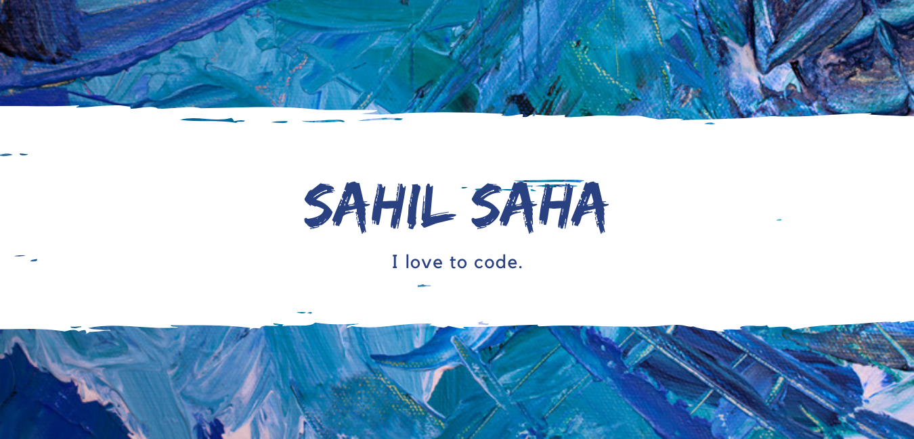

<!---->

## Hi there 👋

Glad to see you here! I am a passionate developer from India, I love to make cool projects and solve coding problems in my free time.

    

  

<h3 align="left">Languages and Tools:</h3>

                                    

    

  

<!--
**sahilsaha7773/sahilsaha7773** is a ✨ _special_ ✨ repository because its `README.md` (this file) appears on your GitHub profile.

Here are some ideas to get you started:

- 🔭 I’m currently working on ...
- 🌱 I’m currently learning ...
- 👯 I’m looking to collaborate on ...
- 🤔 I’m looking for help with ...
- 💬 Ask me about ...
- 📫 How to reach me: ...
- 😄 Pronouns: ...
- ⚡ Fun fact: ...
-->
